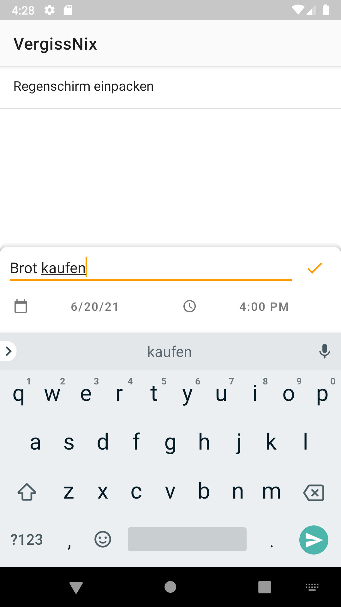
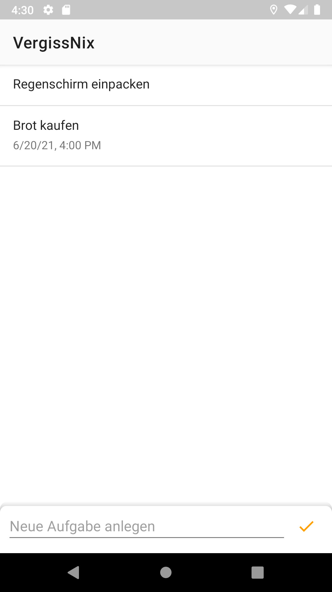

# VergissNix Android App

This app helps you to create short and simple reminders.

For example you can be reminded to take the umbrella with you in the morning or to buy bread in the evening.

The name is composed from the german Vergiss = forget and Nix = nothing. 

Or download the latest APK from the [Releases Section](https://github.com/andipabst/vergiss-nix/releases/latest).

## Screenshots

|                                   Task List                                   |                                   Creating/Editing a Task                                    |
:-----------------------------------------------------------------------------: | :--------------------------------------------------------------------------------------------:
|  |   |

## Known Bugs
- After changing the date or time for a task, the old notification still exists
